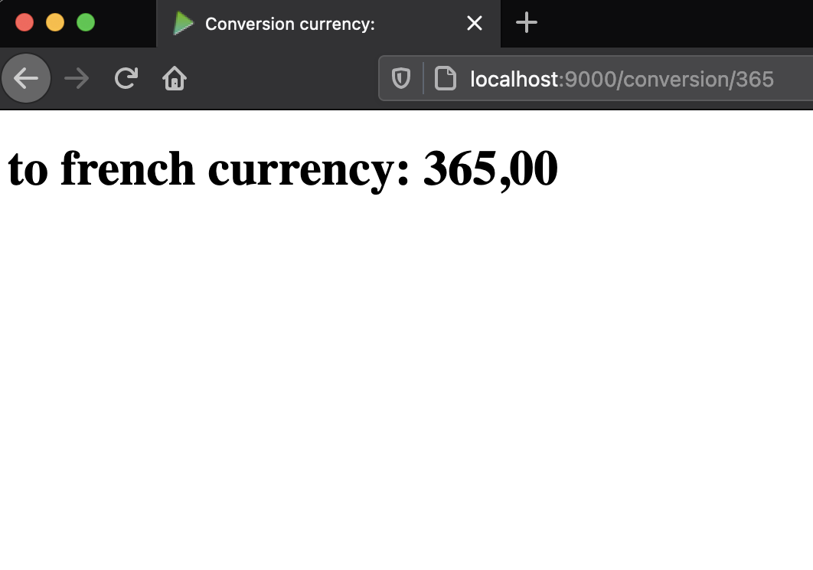

# play-framework-example-web

This repository is a simple example of use Play Framework

### Tools

This project requires the next tools installed

- sbt 1.4.1
- scala 2.13.3
- java jdk8

### Run

Type the next command in terminal

`$ sbt run`

Check in your browser: http://localhost:9000/conversion/365

